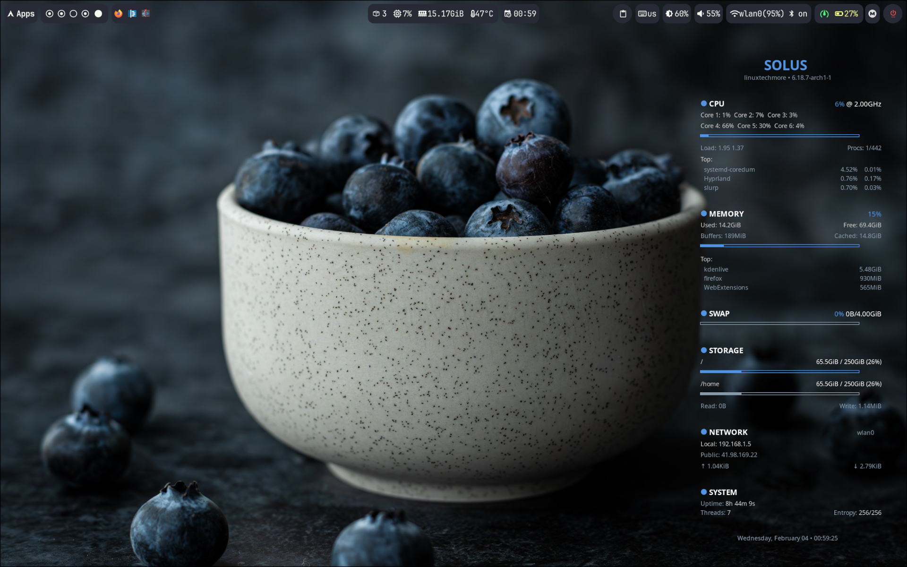

# Solus Conky Themes

Originally created in 2016, I have completely modernized the classic Octupi/Solus theme, refactoring the codebase to utilize the latest Lua API and Cairo graphics engine for enhanced stability and high-performance rendering.

## Available Themes

### Octopus Theme (X11)
**Location:** `solus-octopus-conky-x11/`

The classic Octopus-inspired dashboard with curved arms radiating from a central logo. Features full Lua Cairo graphics for smooth, animated rendering.


- Full Cairo graphics with curved "octopus arms"
- CPU, RAM, SWAP, Disk, Network, and Uptime monitoring
- Top processes and memory consumers
- Dark and Light theme modes
- Adjustable scale to fit any display

> [!IMPORTANT]
> **Why is Octopus not available on native Wayland?**
> 
> The Octopus theme uses Lua Cairo and Imlib2 for graphics rendering, which require X11. Native Wayland Conky cannot display custom images or Cairo-drawn elements because these libraries depend on X11 for rendering. On Wayland compositors, use the Pure theme instead, or run Octopus via XWayland (may overlay windows).

---

### Pure Theme (Native Wayland)
**Location:** `solus-pure-conky-wayland/`

A clean, minimalist system monitor designed for native Wayland compositors. Uses Solus brand colors and modern typography.



- **Native Wayland support** with proper layer shell integration
- **Comprehensive stats**: CPU (per-core), Memory (buffers/cached), Swap, Storage, Network (local + public IP), System info
- **Top processes** grouped with their respective sections
- **Adjustable scale** to fit any display
- **Solus brand colors**: Blue #5294E2, Slate #4C5263
- Lightweight, no Lua Cairo required

---

## Quick Start (Automated Install)

The setup script handles everything: **Dependencies, Fonts, Theme Selection, and Configuration**.

```bash
curl -fsSL https://raw.githubusercontent.com/sniper1720/solus-conky-themes/master/setup.sh | bash
```

The installer will:
1. **Detect your session type** (X11 or Wayland)
2. **Recommend the appropriate theme** based on your session
3. **Configure**: Network interface, scale factor, and theme mode
4. **Set up autostart** (optional)

---

## Manual Installation

### 1. Dependencies

This project is designed for **Solus** but works on any Linux distribution with Conky installed.

**Solus:**
```bash
sudo eopkg it conky
```

> **Other distros**: Install `conky` using your package manager (e.g., `pacman -S conky`, `apt install conky`, `dnf install conky`).

### 2. Clone and Install
```bash
git clone https://github.com/sniper1720/solus-conky-themes.git
cd solus-conky-themes
./setup.sh local
```

### 3. Run Manually
```bash
# From installed location (Octopus)
conky -c ~/.config/conky/solus-octopus/conky.conf

# From installed location (Pure)
conky -c ~/.config/conky/solus-pure/conky.conf

# Or directly from repository
conky -c solus-octopus-conky-x11/conky.conf
conky -c solus-pure-conky-wayland/conky.conf
```

---

## Configuration

### Octopus Theme
Edit `~/.config/conky/solus-octopus/settings.lua` after installation:

```lua
local settings = {
    network_interface = "wlan0",
    theme_mode = "DARK",
    scale = 1.0,  -- Adjust to fit your display
}
```

### Pure Theme
Edit `~/.config/conky/solus-pure/conky.conf`:

```lua
local network_interface = "wlan0"
local scale = 1.0  -- Adjust to fit your display
```

---


## Screenshots

See the `screenshots/` folder for preview images.

---

## ❤️ Support the Project

If you find this theme helpful:

<a href="https://www.buymeacoffee.com/linuxtechmore"></a>
<a href="https://github.com/sponsors/sniper1720"></a>

**Other ways to help:**
- Star the Repository
- Report Bugs
- Suggest Features
- Share with friends

---

## License

This project is licensed under the **GPL-3.0 License**. See the [LICENSE](LICENSE) file for details.
